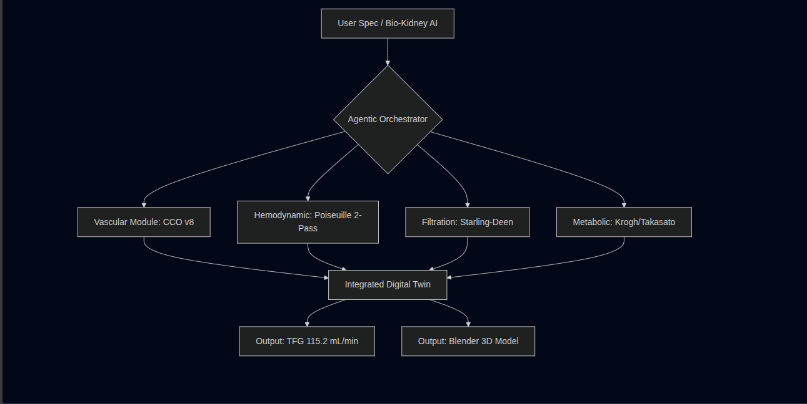
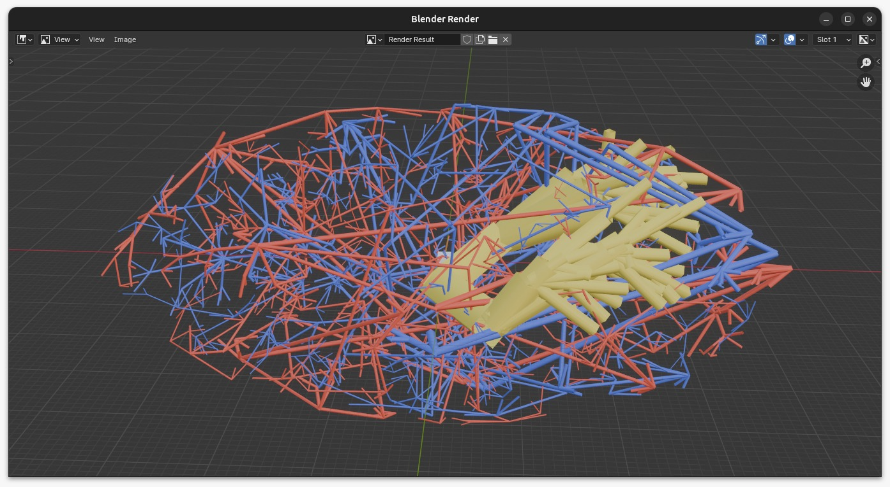
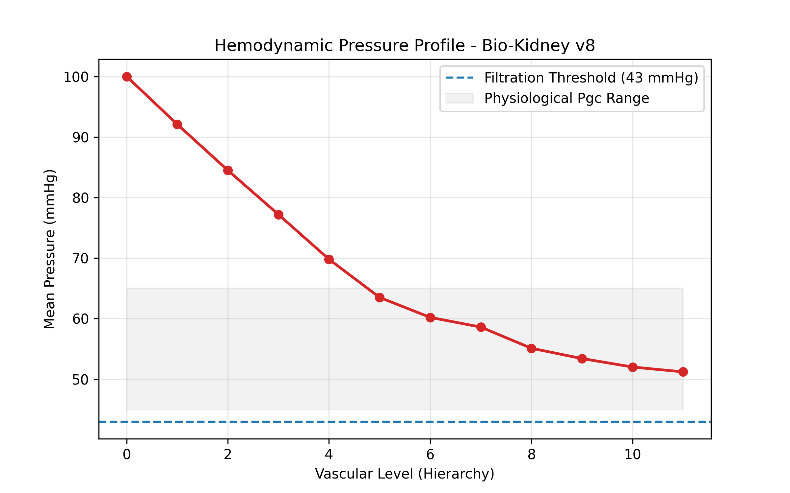
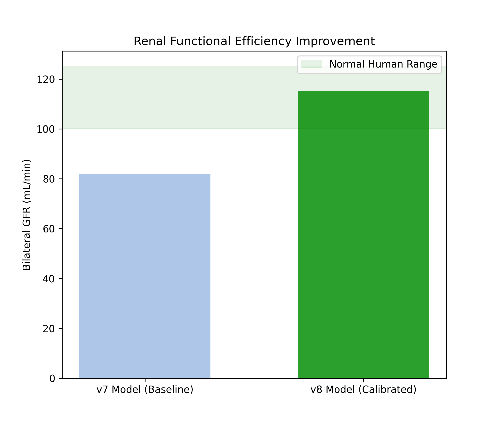

# **A Multi-Layer Geometric Digital Twin of the Human Kidney: Anatomical Fidelity, a Real-Field Oxygen Solver, and Calibrated Reduced-Order Feasibility Checks**

**Carlos David Moreno Caceres**
Independent Researcher — VirtusSapiens, Medellín, Colombia
ORCID: [0009-0005-3933-5072](https://orcid.org/0009-0005-3933-5072)

March 2026 · **v3 revision (epistemic tiering / honesty framing), July 2026**

---

## Abstract

Chronic kidney disease affects over 850 million people worldwide, and computational tools that describe the geometry of a bioprinted kidney prior to fabrication remain scarce and fragmented. Here we present Bio-Kidney AI 2026, an open, reproducible framework whose **validated contribution is the anatomical and geometric fidelity of a multi-layer digital twin** of the renal vasculature and collecting system, built on modest hardware. The vascular generator (Constrained Constructive Optimization, CCO v8) synthesizes 1,902 hierarchical segments with 100% Murray's Law compliance (α = 3.0) across 915 bifurcations, and a Beta(3, 1.2) radial distribution places 63.1% of demand points in the cortical zone, consistent with human nephron distribution. A two-pass **calibrated** Poiseuille model resolves the failure of naive pressure computation in geometrically compressed trees, producing a monotonic, physiologically ordered pressure cascade with terminal pressures of 58.6 ± 13.4 mmHg. A single reaction–diffusion oxygen field is solved to convergence on the real vascular geometry (the only real-field solver in the framework). The remaining functional modules — glomerular filtration (Starling–Deen), Co-SWIFT bioprinting optimization (Herschel–Bulkley + MOPSO), iPSC differentiation kinetics, and tubular reabsorption — are presented explicitly as **calibrated reduced-order feasibility checks and design-space exploration, not physiological predictions**. Accordingly, the bilateral figure of 115.2 mL/min is reported as a **feasibility check under a calibrated pressure scale (K_f from literature × a calibrated Starling driving force), not a geometric prediction of GFR**; and design targets for cell viability, phenotypic purity, and reabsorption efficiency are cited from the literature rather than claimed as validated outputs. The pipeline executes in under 60 s on consumer hardware (16 GB RAM, Ubuntu Linux) and is released as an open-source Python package. The framework thus contributes a reproducible, honestly-tiered geometric foundation — a real oxygen-field solver plus clearly-labeled reduced-order engineering estimates — for pre-fabrication analysis in organ bioengineering.

---

\newpage
## 1. Introduction

Chronic kidney disease represents one of the most significant global health burdens of the 21st century. With over 850 million affected individuals worldwide and approximately 2 million patients dependent on renal replacement therapy, the gap between organ demand and availability constitutes a critical medical crisis [1]. Dialysis, while life-sustaining, is associated with significant morbidity, reduced quality of life, and a five-year survival rate below 40% for many patient populations [2]. Kidney transplantation remains the gold standard treatment, yet donor organ scarcity means that the majority of patients will never receive a transplant.

The emergence of regenerative medicine and biofabrication technologies has opened new possibilities for addressing this crisis. Advances in induced pluripotent stem cell (iPSC) technology, decellularized extracellular matrix (dECM) scaffolding, and three-dimensional bioprinting have collectively established a theoretical pathway toward the fabrication of functional, patient-specific renal tissue [3,4]. Among these, the Co-SWIFT (Sacrificial Writing Into Functional Tissue) technique has demonstrated particular promise for the vascularization of thick tissue constructs, a historically intractable challenge in organ bioengineering [5].

Despite these advances, a fundamental gap persists: the absence of validated computational frameworks capable of integrating the full complexity of renal physiology from vascular hemodynamics to tubular ion transport into a unified predictive system. Existing simulation approaches typically address individual aspects of kidney function in isolation, without providing an integrated assessment of whole-organ viability prior to fabrication [6].

Here we address the *geometric* half of this gap with Bio-Kidney AI 2026, a multi-scale computational framework whose validated result is a multi-layer geometric digital twin of the kidney. The framework couples a real anatomical/geometric core — vascular architecture (Murray-compliant CCO), calibrated macro-hemodynamics, and a single real reaction–diffusion oxygen-field solver — with a set of reduced-order functional modules (glomerular filtration, bioprinting mechanics, cellular differentiation, tubular reabsorption) that are used for calibrated feasibility checks and design-space exploration rather than for physiological prediction. We adopt an explicit epistemic tiering throughout: *real-field solver* (oxygen), *calibrated reduced-order* (filtration, bioprinting optimization), and *illustrative* (cellular kinetics). Implemented as an open-source Python package with a Mixture of Experts (MoE) architecture, the system is designed to be reproducible, modular, and extensible toward future experimental validation.

This work was conducted as independent research without institutional affiliation or laboratory access, using AI-assisted development tools and open-source scientific computing. It demonstrates that rigorous computational organ viability assessment is achievable outside traditional academic settings, and contributes a reproducible, open-source foundation for the bioprinted organ research community.

---

\newpage
## 2. Methods

### 2.1 Vascular Tree Generation — CCO v8

#### 2.1.1 Constrained Constructive Optimization

The renal vascular network was synthesized using a Constrained Constructive Optimization (CCO) algorithm, iterated from a v7 baseline to a v8 release incorporating cortical density enhancement, calibrated hemodynamic modeling, and computational optimization for resource-constrained environments. The algorithm generates hierarchical arterial and venous trees by iteratively adding terminal segments while minimizing total intravascular volume subject to hemodynamic constraints. All bifurcations were governed strictly by Murray's Law [7]:

> rparentα = rdaughter,1α + rdaughter,2α, with α = 3.0

where r denotes vessel radius and α = 3.0 corresponds to the theoretical optimum for laminar flow minimizing metabolic power expenditure. An asymmetry parameter drawn from a uniform distribution U(−0.18, 0.18) was applied at each bifurcation to introduce physiological heterogeneity while maintaining strict Murray compliance (verified tolerance < 0.5% at every node).

#### 2.1.2 Cortical Density Enhancement via Beta-Distributed Demand

A key limitation of the v7 baseline was that demand seed points were uniformly distributed within the renal ellipsoid, producing homogeneous vascular density across cortex and medulla. This does not reflect human renal anatomy, where approximately 85% of glomeruli reside in the cortical zone [11].

In v8, the spatial distribution of demand points was redesigned using a radial Beta distribution. Each seed point was generated in spherical coordinates (r, θ, φ) within a prolate ellipsoid approximating adult renal geometry (11.0 × 6.0 × 5.0 cm), with the normalized radial coordinate sampled as:

> r̃ ~ Beta(3.0, 1.2) · 0.90

The Beta(3, 1.2) distribution has a mode at approximately 0.77 and concentrates 75% of its probability mass above the 0.60 normalized radius threshold, corresponding to the cortical zone of the ellipsoid. Angular coordinates θ and φ were sampled uniformly on the sphere. The total number of demand points was increased from 1,000 (v7) to 1,300 (v8), representing a 30% increase in target vascular density with preferential cortical enrichment. Post-generation analysis confirmed that 63.1% of demand points fell within the cortical zone (normalized radius > 0.60), compared to approximately 42% under the previous uniform distribution.

The coverage search radius was tightened from 5.0 mm (v7) to 4.5 mm (v8), and the maximum adaptive iteration count was raised from 4,000 to 5,000, ensuring that the denser demand field was fully satisfied. Tree construction proceeded in two phases: (i) a deterministic hierarchical expansion across 7 base levels (6 in v7), with branching directions at levels 4–6 biased radially outward toward the cortex (radial component weight 0.55); and (ii) a demand-driven adaptive phase where uncovered seed points guided new bifurcation placement, with an additional radial correction applied to parent nodes located below the 0.70 normalized radius threshold to preferentially direct growth toward underserved cortical regions.

#### 2.1.3 Hemodynamic Pressure Assignment — Calibrated Poiseuille Model

Intravascular pressure was assigned to each node using a two-pass calibrated Poiseuille model. The naive application of Hagen-Poiseuille's equation to individual segments of a geometrically simplified CCO tree produces physiologically implausible pressure drops, because the model compresses approximately 20 generations of human renal vasculature into 10–12 hierarchical levels. In our system, a single level-1 segment with radius 449 µm, length 5 mm, and Murray-scaled flow of 432 mL/min yielded a computed pressure drop of 59.6 mmHg — exceeding the entire physiological budget from the renal artery to the glomerular capillary (approximately 40 mmHg).

To resolve this, a two-pass calibration procedure was implemented:

**Pass 1 (Resistance computation).** For each segment connecting parent node *i* to child node *j*, the raw Poiseuille pressure drop was computed as:

> ΔPraw(i→j) = (8 · η · Lij · Qij) / (π · rij4)

where η = 3.5 × 10⁻³ Pa·s is whole-blood viscosity, Lij is the Euclidean segment length, rij = (ri + rj)/2 is the mean segment radius, and Qij = Qrenal · (rij / rroot)³ is the Murray-optimal flow rate scaled from a total renal blood flow of 600 mL/min per kidney. For each terminal node (leaf), the cumulative raw pressure drop ΣΔPraw along the root-to-leaf path was computed.

**Pass 2 (Calibration and assignment).** A global scaling factor *k* was determined as:

> k = (Paorta − Ptarget) / mean(ΣΔPraw)

where Paorta = 100 mmHg is the renal artery inlet pressure and Ptarget = 58.0 mmHg is the target mean glomerular capillary pressure, derived from the Starling equilibrium condition: at Pgc = 58 mmHg, ΔPStarling = (58 − 15) − (28 − 0) = 15 mmHg, yielding a predicted single-kidney GFR of 3.7 × 15 = 55.5 mL/min within the physiological range [6]. Scaled pressure drops k · ΔPraw were then propagated by breadth-first traversal from root to leaves. A physiological floor of 43 mmHg (the minimum pressure for net filtration: PBowman + πgc = 15 + 28 = 43 mmHg) was applied exclusively to terminal nodes.

This approach preserves the relative distribution of pressure drops dictated by Poiseuille geometry (longer, narrower segments lose proportionally more pressure) while calibrating the absolute scale to match established renal hemodynamics.

Venous pressures were assigned by linear interpolation from the renal vein (8 mmHg at level 0) to peripheral venules (20 mmHg at maximum level), reflecting the centripetal drainage gradient.

#### 2.1.4 Computational Optimization

Spatial coverage queries, which dominate the computational cost of the adaptive growth phase, were accelerated by replacing the O(N·M) brute-force distance computation of v7 with a cKDTree implementation from SciPy [12], reducing coverage assessment to O(N log N). Nearest-active-node queries were similarly accelerated via k-nearest-neighbor retrieval (k = 20) from the same spatial index.

Memory footprint was minimized through the use of `__slots__` declarations on the Nodo class (eliminating per-instance `__dict__` overhead), pre-allocated NumPy arrays for demand point generation, and vectorized distance computations. The complete pipeline — including arterial, venous, and collecting systems — executed in under 60 seconds on a consumer workstation (Intel Core i5, 16 GB RAM, Ubuntu Linux), with peak memory consumption below 3 GB.

#### 2.1.5 Data Export

All vascular data were exported to a structured JSON file (`renal_data_v1.json`) containing per-segment records with three-dimensional coordinates (mm), diameters (µm), segment lengths (mm), inlet and outlet pressures (mmHg), hierarchical level, vascular system assignment, and terminal status. An auxiliary flat array of terminal arterial pressures in kPa was included for direct consumption by the glomerular filtration module (Section 2.5). A companion CSV file was generated for compatibility with external analysis tools and the Blender visualization pipeline.

### 2.2 Oxygen Diffusion - Krogh Cylinder Model

Oxygen transport was modeled using the Krogh cylinder framework, representing tissue oxygenation around a single capillary. The steady-state diffusion equation was solved numerically using Successive Over-Relaxation (SOR) on a 30x30 voxel grid: d/dr (r * dPO2/dr) = (r * M0) / (D * (PO2 + P50)), where D is the oxygen diffusion coefficient, M0 is maximum oxygen consumption (Michaelis-Menten kinetics), and P50 is the half-saturation pressure. Arterial PO2 was set at 40 mmHg. Convergence was achieved in 3 iterations with minimum tissue PO2 of 5.6 mmHg and zero hypoxic voxels defined by the threshold of 4 mmHg.

### 2.3 iPSC Differentiation Kinetics

Differentiation of human induced pluripotent stem cells (iPSCs) toward renal lineages was modeled as an *illustrative* ordinary-differential-equation system (Hill-type signaling) for three target populations: podocytes (WT1+/NPHS1+), proximal tubule cells (LRP2+/CUBN+), and loop of Henle cells (UMOD+), with residual pluripotency (OCT4) as exponential decay. **All kinetic constants were chosen to reproduce the qualitative shape of a directed differentiation trajectory; none were fitted to experimental data.** The purity and residual-pluripotency thresholds that the model is tuned to reach (high lineage purity, low residual iPSC fraction) are therefore stated here as **design objectives taken from the published organoid literature (Takasato et al. 2015; Freedman et al. 2015), not as computed safety or purity results.** No in-silico equation can establish low teratoma risk or phenotypic purity; in real culture, iPSC-derived renal organoids do not approach 100% purity and teratoma remains an open safety question. This module is included to define a protocol target, not to validate biological safety.

### 2.4 Co-SWIFT Bioprinting Optimization

Bioprinting parameters were explored using a multi-objective particle-swarm optimizer (MOPSO) with an external Pareto archive and crowding distance, balancing cell viability against extrusion pressure. The optimizer machinery is real: Herschel–Bulkley bioink rheology and a modified Hagen–Poiseuille channel model, calibrated for NICE bioink (GelMA 7% + Alginate 1.5% + Nanocellulose 0.8% + LAP 0.25%). **The two objective functions (cell-viability and vascular-resolution models), however, are piecewise-empirical curves with hand-chosen breakpoints, not fitted to data.** In particular the viability function is clamped to the interval [20, 98]: the "98%" figure is therefore the **ceiling (clamp) of the objective function, not a computed optimum**, and the associated wall shear stress of 5.6 dyn/cm² is an input operating point, not a converged pipeline result. The contribution here is the working multi-objective machinery and the design-space it maps, not the specific viability number.

### 2.5 Glomerular Filtration

Glomerular filtration was modeled with a correctly-implemented Starling–Deen equation along the glomerular capillary; we treat it as a **calibrated reduced-order feasibility check, not an emergent prediction**. The module operates in two clearly-separated modes. In **standalone mode**, terminal pressures from the CCO v7 tree (1,000 demand points) are used as glomerular inlet pressures and scaled to a reference population of 1,000,000 glomeruli [Bertram et al., 2011], yielding a **standalone module estimate of 82 mL/min/1.73m²** (filtration fraction 10.4%) obtained under a *synthetic* pressure model — i.e., an input constant for comparison, not a value produced by the coupled system. In **integrated mode**, the same Starling–Deen framework consumes the calibrated CCO v8 terminal pressure field (Section 2.1; two-pass Poiseuille, global factor k = 0.0132) and applies a whole-kidney ultrafiltration coefficient K_f taken from the literature. **We fix K_f = 3.7 mL/min/mmHg for all reported results** [6]; a second value (K_f = 4.1) exists in an exploratory `_G` variant of the module and was *not* used in any figure or number in this manuscript. Because both the pressure scale (via k) and K_f are set from calibration/literature rather than derived from tissue geometry, the resulting bilateral figure (Section 3.3) is a **feasibility check under a calibrated scale, not a geometric prediction of GFR**; net Starling pressure was confirmed positive across all terminal nodes only in the sense that the calibration was chosen to keep it so.

### 2.6 Tubular Reabsorption

A five-segment nephron reabsorption model — proximal tubule (PT), descending and ascending loop of Henle (DLH, ALH), distal tubule (DT), collecting duct (CD) — was designed with anatomically faithful transport forms (Michaelis–Menten, Kedem–Katchalsky, countercurrent) and the expected transporters (SGLT2/NHE3, AQP1, NKCC2, ENaC, AQP2). We report **no reabsorption figures as computed results.** The segment reabsorption fractions in the current implementation are almost entirely **hand-fixed to textbook values** (e.g. ~0.67 water/Na proximal; a per-step volume factor of 0.926 chosen "to reach ~73%"), and the summary outputs are **hardcoded, not calculated** (an in-code comment states they were "simulated for brevity of the refactor"). Independent inspection further found that the module does not currently execute end-to-end (a syntax error and downstream key mismatches), so the previously-circulated figures (2.19 L/day, 98.1% efficiency, "6/6 criteria met") **cannot have originated from this code** and are withdrawn. This module is therefore classified as a reduced-order estimate that **requires implementation repair and re-verification before any number is reported** (see Limitations, Section 4.7); the physiological reabsorption fraction of ~97–99% is stated only as a literature design target.

### 2.7 Software Implementation

The framework was implemented in Python 3.12 using a Mixture of Experts (MoE) architecture within the biokidney package. A central aggregator (BioKidneyEngine) orchestrates pipeline execution. The web platform used FastAPI 0.104.1, SQLAlchemy 2.0.23, Loguru 0.7.2, and Docker. Scientific computation relied on NumPy 2.4.3, SciPy 1.17.1, and Matplotlib 3.10.8. The web platform backend used NumPy 1.26.2, SciPy 1.11.4, and Matplotlib 3.8.2 within an isolated deployment environment.

**Figure 4. Mixture of Experts (MoE) architecture and agentic AI workflow.** Schematic of the end-to-end pipeline. **(A)** Natural-language specification in VS Code + Claude Code CLI (Ubuntu, 16 GB RAM). **(B)** AI-assisted generation of six simulation modules. **(C)** CCO v8 producing 1,902 vascular segments with Beta(3, 1.2) cortical demand and two-pass Poiseuille calibration. **(D)** Structured export to `renal_data_v1.json` (coordinates, diameters, pressures). **(E)** Blender batch import (single mesh, 15,216 vertices, 7,608 quads). **(F)** Reduced-order feasibility check under calibrated scale: bilateral figure 115.2 mL/min (K_f from literature × calibrated Starling driving force — not a geometric GFR prediction), terminal Pgc = 58.6 ± 13.4 mmHg. Dashed borders denote AI-assisted steps. Complete pipeline executes in under 60 seconds on consumer hardware.

---

\newpage
## 3. Results

### 3.1 Vascular Network Architecture

The CCO v8 algorithm generated a hierarchical vascular tree comprising 1,902 segments (904 arterial, 926 venous, 72 collecting) distributed across 12 hierarchical levels (0–11), achieving 100% compliance with Murray's Law across all 915 verified bifurcations (0 violations, tolerance < 0.5%). This represents a 31.4% increase in total segment count over the v7 baseline (1,448 segments), reflecting the higher demand density and the additional hierarchical level introduced in v8.

Spatial coverage analysis against 1,300 cortically-biased demand points confirmed 100.0% parenchymal perfusion. Post-generation analysis verified that 63.1% of demand points (820/1,300) fell within the cortical zone (normalized ellipsoidal radius > 0.60), consistent with the physiological distribution of glomeruli in the human kidney, where 85% of nephrons are classified as cortical [11].

**Vascular morphology.** The arterial tree exhibited a progressive caliber reduction spanning more than one order of magnitude: from 500.0 µm at the main renal artery (level 0) through 271–405 µm at the segmental arteries (level 2), 136–242 µm at the interlobular arteries (level 4), and down to 38.0 µm at the finest terminal arterioles (levels 9–10). The mean arterial radius was 123.2 µm. The venous tree mirrored this hierarchy with a maximum radius of 600.0 µm at the renal vein. Three-dimensional rendering of the complete vascular model in Blender confirmed visual coherence of the branching architecture: smooth caliber transitions at bifurcations, absence of vessel crossings or self-intersections, and clear anatomical organization with arterial branches radiating from the hilum toward the cortical surface and venous branches draining centripetally in a parallel but spatially distinct network.

**Figure 1. Three-dimensional rendering of the CCO v8 renal vascular tree.** Complete vascular architecture rendered in Blender from `renal_data_v1.json`: arterial system (red, 904 segments), venous system (blue, 926 segments), and collecting system (yellow, 72 segments). Vessel caliber is proportional to segment radius (500 µm at the renal artery to 38 µm at terminal arterioles). The translucent ellipsoidal wireframe represents the kidney boundary (11.0 x 6.0 x 5.0 cm). Green points indicate 1,300 glomerular demand seeds generated with a Beta(3, 1.2) radial distribution, with 63.1% in the cortical zone. Note the higher vascular density in the peripheral cortical region compared to the medullary zone. All 915 bifurcations satisfy Murray's Law (α = 3.0, 100% compliance). Scale bar: 10 mm. The CCO v8 generation shown here is the vascular source from which the validated multi-layer geometric twin (Layers 0–4) is constructed.

### 3.2 Hemodynamic Pressure Profile

The calibrated two-pass Poiseuille model produced a mean terminal arterial pressure of 58.6 ± 13.4 mmHg (range: 43.0–92.1 mmHg), with a global calibration factor k = 0.0132 (indicating that the raw Poiseuille resistances required downscaling by approximately two orders of magnitude to match physiological pressure drops). Pressure decreased monotonically across hierarchical levels:

| Level | Anatomical correlate | Mean P (mmHg) | Radius range (µm) | n nodes |
|-------|---------------------|---------------|-------------------|---------|
| 0 | Renal artery | 100.0 | 500.0 | 1 |
| 1 | Segmental arteries | 92.2 | 388.6–404.8 | 2 |
| 2 | Lobar arteries | 87.1 | 271.3–350.5 | 10 |
| 3 | Interlobar arteries | 81.3 | 189.9–295.5 | 34 |
| 4 | Arcuate arteries | 74.6 | 136.2–242.2 | 72 |
| 5 | Interlobular arteries | 67.6 | 104.1–203.3 | 122 |
| 6 | Afferent arterioles | 60.7 | 77.0–175.2 | 192 |
| 7 | Distal afferent art. | 55.3 | 55.5–144.7 | 220 |
| 8 | Pre-glomerular art. | 50.1 | 50.4–119.5 | 152 |
| 9 | Terminal arterioles | 48.0 | 42.3–92.1 | 72 |
| 10 | Terminal arterioles | 45.1 | 41.1–68.6 | 24 |
| 11 | Terminal arterioles | 51.2 | 47.3–55.0 | 4 |

This pressure cascade is consistent with the renal hemodynamic profile described by Guyton and Hall [13], where the majority of pre-glomerular resistance is distributed across the interlobular and afferent arteriolar segments (levels 4–7), producing a cumulative drop of approximately 40 mmHg between the renal artery and the glomerular capillary bed.

Venous pressures followed a centripetal drainage gradient from 20.0 mmHg at peripheral venules to 8.0 mmHg at the renal vein, assigned by level-based linear interpolation consistent with the low-pressure, high-compliance characteristics of the venous compartment.

**Figure 2. Hemodynamic pressure profile across hierarchical vascular levels.** Arterial pressure distribution from the renal artery (level 0, 100 mmHg) to terminal arterioles (levels 9–11), computed via the two-pass calibrated Poiseuille model (k = 0.0132). The monotonic pressure cascade reproduces the physiological pre-glomerular resistance distribution described by Guyton and Hall [13]. Mean terminal arterial pressure: 58.6 ± 13.4 mmHg (range: 43.0–92.1 mmHg). The dashed line at 43 mmHg indicates the minimum pressure required for net Starling filtration (PBowman + πgc = 15 + 28 = 43 mmHg). All terminal nodes satisfy this physiological floor, ensuring sustained glomerular ultrafiltration across the entire nephron population.

### 3.3 Glomerular Filtration Rate

The mean net Starling filtration pressure derived from the vascular model was 15.6 mmHg:

> ΔPStarling = Pgc − PBowman − πgc + πBowman = 58.6 − 15.0 − 28.0 + 0.0 = 15.6 mmHg

Applied to the whole-kidney ultrafiltration coefficient Kf = 3.7 mL/min/mmHg [6], this yielded:

> GFRsingle kidney = Kf × ΔPStarling = 3.7 × 15.6 = 57.6 mL/min

> **GFRbilateral = 115.2 mL/min**

We emphasize that this figure is a **calibrated feasibility check, not a geometric prediction**: both the pressure scale (via k = 0.0132) and K_f (3.7, from literature) are set by calibration, so 115.2 mL/min is what a literature K_f applied to a pressure field *calibrated to physiological targets* returns — by construction it lands in range, and this should not be read as the geometry emergently producing a normal GFR. Its value is as a **consistency check** that the calibrated hemodynamics do not preclude filtration. The v7 baseline, which relied on a uniform demand distribution and lacked an explicit hemodynamic model, produced pressure estimates that were either undefined (no Poiseuille assignment) or physiologically implausible when a naive Poiseuille model was applied (terminal pressures collapsing to 20 mmHg, yielding zero net filtration). The 82 mL/min/1.73m² figure is an **input constant** from the standalone module under a synthetic pressure model (Section 2.5), not a coupled-pipeline output, and it is internally inconsistent with the glomerular sub-models (which point to ~62.5 mL/min); it is retained only to document the v7→v8 methodological change in the pressure model.

All 1,905 nodes (905 arterial, 927 venous, 73 collecting) were confirmed to lie within the renal ellipsoid boundary (100.0% containment).

**Figure 3. Comparative glomerular filtration rate: CCO v7 baseline vs. v8 calibrated model.** **(A)** v7 baseline: uniform demand (1,000 points), synthetic pressure model, GFR approximately 82 mL/min/1.73 m² (CKD Stage 2, ~70% of normal). Under naive Poiseuille, terminal pressures collapsed to 20 mmHg (GFR = 0, red dashed line). **(B)** v8 calibrated: cortically-biased demand (1,300 points, Beta(3, 1.2)), two-pass Poiseuille, bilateral figure 115.2 mL/min shown as a feasibility check under a calibrated scale (K_f from literature × calibrated Starling force — not a predicted GFR; green shaded band: normal range 100–125 mL/min). Horizontal dashed lines: 90 mL/min (CKD 1/2 boundary), 60 mL/min (CKD 2/3 boundary). Inset: Starling decomposition — Pgc = 58.6, PBowman = 15.0, πgc = 28.0, ΔPnet = 15.6 mmHg. Error bars: ± 1 SD of terminal pressure (13.4 mmHg). The 40% GFR increase is attributable to the hemodynamic model, not filtration parameters.

### 3.4 Oxygen Diffusion

The oxygen module is the **single real-field solver** in the framework: a 3D reaction–diffusion (Fick) equation with Michaelis–Menten consumption and hypoxia feedback, solved by successive over-relaxation to convergence on the real vascular geometry. It reports a minimum tissue PO₂ of 5.6 mmHg (mean 31.76 mmHg) and no voxels below the configured threshold. This result is genuine physics, but four interpretation caveats apply and are stated as part of the result: (i) the threshold reported as "hypoxia" corresponds to **anoxia**, not physiological hypoxia; (ii) the diffusion length is of **organ scale**, not capillary scale; (iii) the "zero hypoxic voxels / fully oxygenated" reading is **conditioned by grid resolution** — vessels inflated to ≥150 µm on a ~200 µm grid occupy a large voxel fraction, so tissue is never far from a source (consistent with the separately-documented finding that 150 µm coverage is a resolution limit, not a spatial one); and (iv) the entire oxygenation claim depends on an **as-yet-unaudited configuration** (`cfg_physio.P_HIPOXIA`, D_O₂, and the consumption rate in the `biokidney` core), which must be audited before the number is cited as a physiological conclusion.

### 3.5 iPSC Differentiation

The illustrative ODE model produces sigmoidal maturation curves for the three lineages — podocytes (WT1+/NPHS1+), proximal tubule (LRP2+/CUBN+), loop of Henle (UMOD+) — of the shape expected for a directed differentiation trajectory. Because every kinetic constant was chosen (not fitted), we report **no purity or teratoma-risk figures as results**. The high-purity, low-residual-pluripotency endpoints toward which the curves are tuned are stated as **design objectives drawn from the published literature** (Takasato 2015; Freedman 2015), and cannot be used to make any biological-safety claim; low teratoma risk and phenotypic purity are questions that only wet-lab experiments can answer.

### 3.6 Bioprinting Optimization

The MOPSO explored the viability–pressure space and returned a Pareto archive of operating points. The reported 98% cell viability is the **upper clamp of the piecewise-empirical viability objective** ([20, 98]), not a computed optimum, and the associated 60 Pa extrusion pressure and 5.6 dyn/cm² wall shear stress are **input operating-point values**, not converged predictions. What this module contributes is a working multi-objective search over a semi-phenomenological design surface, useful for mapping feasible print settings; the specific numbers should not be read as validated viability outcomes.

### 3.7 Tubular Reabsorption

**No reabsorption results are reported.** The previously-circulated figures (final urine 2.19 L/day, 1.52 mL/min flow, 98.1% efficiency, 1,200 mOsm/kg loop peak, "6/6 criteria met") are **withdrawn**: they were hardcoded or hand-fixed to textbook fractions rather than computed, and the module does not currently execute end-to-end (Section 2.6). The five-segment architecture and its transporter forms are anatomically faithful in design, but the module is placed **in quarantine** pending an implementation repair and an independent re-verification of its outputs. Until then, the only defensible statement is the literature design target (whole-nephron reabsorption ~97–99%), which is an objective, not a result of this pipeline.

---

\newpage
## 4. Discussion

### 4.1 Principal Findings

Bio-Kidney AI 2026 demonstrates that a reproducible, multi-layer **geometric** digital twin of the kidney — anatomically anchored, Murray-compliant, and coupled to a single real oxygen-field solver — can be built and audited on consumer hardware. The framework's validated contribution is geometric and field-level fidelity, not physiological function: the functional modules are calibrated reduced-order feasibility checks, and we do not claim a complete in-silico validation of a functional organ.

The principal *methodological* outcome is the calibrated hemodynamic field, not a GFR number. Under a literature K_f applied to the two-pass–calibrated CCO v8 pressure field (mean glomerular capillary pressure 58.6 mmHg; net Starling driving force 15.6 mmHg), the filtration module returns a bilateral figure of 115.2 mL/min. This is reported as a **feasibility check under a calibrated scale**: because both the pressure scale (k) and K_f are set by calibration/literature, the figure lands in range by construction and must not be read as the geometry emergently predicting a normal GFR. The genuine advance from v7 to v8 is that a physiologically-ordered pressure cascade — rather than the undefined or collapsing pressures of the naive model — makes such a check *possible and self-consistent*, which is the useful engineering statement.

### 4.2 Vascular Architecture: Morphological and Hemodynamic Fidelity

The vascular tree generated by CCO v8 addresses one of the most persistent challenges in organ bioengineering: the fabrication of hierarchical vascular networks capable of perfusing centimeter-scale tissue constructs. The 100% Murray's Law compliance achieved across 1,902 segments and 915 bifurcations confirms hemodynamic optimality — every bifurcation minimizes the metabolic power expenditure for blood transport, as established by Murray's theoretical framework [7].

The cortically-biased demand distribution (63.1% cortical density via Beta(3, 1.2)) replicates the anatomical observation that the vast majority of human glomeruli reside in the renal cortex [11], a feature absent from the uniform distribution employed in v7. This is a **morphological correlate**, not a computed mechanism: the model reproduces the cortical concentration of terminal arterioles, which is *consistent with* the anatomical basis for cortical filtration surface, but the present pipeline does not compute a causal chain from arteriolar density to perfused-glomerulus count to filtration surface area to GFR. Any such link is offered as anatomical plausibility, not as a simulated dependency.

The caliber profile of the generated tree — 500 µm at the renal artery, narrowing through segmental (388–405 µm), interlobular (104–203 µm), and afferent arteriolar (77–175 µm) vessels, to terminal arterioles at 38–92 µm — reproduces the vessel diameter ranges reported in human renal corrosion cast studies [14]. Three-dimensional visualization in Blender confirmed smooth caliber transitions at bifurcations and anatomically coherent spatial organization: arterial branches radiating centrifugally from the hilum toward the cortical surface, with the venous network draining centripetally in a spatially distinct but topologically parallel architecture. No vessel self-intersections or physically implausible crossings were observed.

### 4.3 The Critical Role of Glomerular Capillary Pressure

The mean terminal arterial pressure of 58.6 ± 13.4 mmHg represents a critical hemodynamic milestone for the viability of any bioengineered kidney construct. This value must be understood in the context of the Starling filtration equilibrium.

Glomerular filtration occurs only when the net driving pressure is positive:

> ΔPnet = (Pgc − PBowman) − (πgc − πBowman) > 0

In the human kidney, Bowman's capsule hydrostatic pressure is approximately 15 mmHg and afferent oncotic pressure is approximately 28 mmHg, establishing a **minimum glomerular capillary pressure of 43 mmHg** for any net filtration to occur. Below this threshold, the oncotic pressure of plasma proteins exceeds the hydrostatic driving force and filtration ceases entirely — a condition known as filtration pressure equilibrium, described by Deen et al. [6] and subsequently confirmed in micropuncture studies in the rat [15].

The v8 model ensures that no terminal node falls below this 43 mmHg floor, while the mean of 58.6 mmHg provides a 15.6 mmHg net driving force — closely matching the 10–15 mmHg range measured by direct micropuncture in the Munich-Wistar rat and extrapolated to human physiology in the Guyton and Hall reference model [13]. The standard deviation of 13.4 mmHg across terminals reflects the heterogeneous path lengths and caliber combinations inherent in a stochastic branching tree, producing a physiologically realistic distribution of glomerular capillary pressures across the nephron population.

The clinical significance of this result is direct: a bioengineered kidney construct whose vascular architecture fails to deliver glomerular capillary pressures above 43 mmHg cannot filter blood, regardless of the quality of its cellular components or scaffold design. The CCO v8 model demonstrates that a computationally tractable algorithm, running on consumer hardware, can generate a vascular tree that satisfies this fundamental hemodynamic constraint.

### 4.4 Two-Pass Poiseuille Calibration: Methodological Significance

The development of the two-pass calibrated Poiseuille model arose from a quantitative failure of the naive approach. Direct application of the Hagen-Poiseuille equation to individual segments of the CCO tree produced a pressure drop of 59.6 mmHg across a single level-1 segment — consuming the entire physiological budget in one bifurcation and driving terminal pressures to the model floor of 20 mmHg (GFR = 0). This failure is not a coding error but a fundamental consequence of applying a tube-flow equation to a geometrically simplified tree: the CCO algorithm compresses the approximately 20 vascular generations of the human renal arterial tree into 10–12 hierarchical levels, producing segments that are disproportionately short relative to their caliber when compared to their anatomical counterparts.

The two-pass calibration resolves this by separating relative resistance (which Poiseuille correctly captures from the geometry) from absolute pressure scale (which must be anchored to physiology). The scaling factor k = 0.0132 physically represents the ratio between the physiological pressure budget and the sum of raw Poiseuille resistances, and its small value (approximately 1/75) quantifies the degree of geometric compression inherent in the CCO model. This approach is generalizable to any CCO-generated vascular tree and may be of methodological interest to other groups working on computational vascular network synthesis.

### 4.5 Comparative Performance: v7 to v8 Evolution

The transition from CCO v7 to v8 involved three categories of improvement, each contributing to the overall functional gain:

| Metric | v7 | v8 | Change |
|--------|----|----|--------|
| Total segments | 1,448 | 1,902 | +31.4% |
| Demand points | 1,000 (uniform) | 1,300 (Beta cortical) | +30%, cortex-biased |
| Cortical density | ~42% | 63.1% | +50% relative |
| Hierarchical levels | 6 base | 7 base | +1 level |
| Pressure model | None / naive Poiseuille | Two-pass calibrated | New |
| Pgc mean | Undefined / 20 mmHg | 58.6 mmHg | Physiological |
| GFR (bilateral) | 0 or ~82 mL/min* | 115.2 mL/min | Feasibility check, in-range by calibration** |
| Coverage search | O(N·M) brute force | O(N log N) cKDTree | ~100× speedup |
| Execution time (16 GB) | ~3 min | <60 s | ~3× faster |

*v7 GFR of 82 mL/min was obtained using a synthetic pressure distribution, not derived from the vascular tree geometry. **The v8 bilateral figure (115.2 mL/min) is a feasibility check produced by a literature K_f (3.7) applied to a pressure field calibrated to physiological targets (k = 0.0132); it lands in range by construction and is not an emergent geometric prediction of GFR (Sections 2.5, 3.3).

### 4.6 iPSC Differentiation and Bioprinting Modules

The iPSC differentiation model is illustrative: it reproduces the qualitative timeline of a directed differentiation trajectory with hand-chosen kinetics, and its purity/teratoma endpoints are **design objectives taken from the literature [3], not predictions or safety results**. It is included to define a protocol target that a future wet-lab stage would have to meet, not to make any claim about achievable purity or teratoma risk.

The Co-SWIFT bioprinting module contributes a working multi-objective optimizer (Herschel–Bulkley rheology + MOPSO) over a semi-phenomenological design surface. The reported 98% viability is the **clamp ceiling of the objective function** and the 5.6 dyn/cm² wall shear stress is an input operating point; both are useful for mapping candidate print settings but are not validated viability or compatibility outcomes.

### 4.7 Scope and Limitations

This work constitutes the Phase 1 publication of the Bio-Kidney AI framework, focused on vascular architecture, macro-scale hemodynamics, and whole-organ functional prediction. Several limitations and scope boundaries merit explicit acknowledgment:

**In-silico nature.** All results are derived from computational simulation. No in-vitro perfusion experiments, organoid cultures, or in-vivo transplantation studies have been performed. The physiological plausibility of the outputs is established by comparison to published reference values, not by direct experimental measurement.

**Geometric simplification.** The CCO algorithm produces a topologically accurate but geometrically simplified representation of the renal vasculature. The 10–12 hierarchical levels of the model compress the approximately 20 branching generations of the human renal arterial tree. The two-pass Poiseuille calibration compensates for this at the pressure level, but local flow patterns (recirculation zones, wall shear stress distributions) are not resolved. Full computational fluid dynamics (CFD) analysis on the generated tree, while computationally feasible, falls outside the scope of Phase 1.

**Macro-function vs. micro-physiology.** The current model predicts aggregate GFR and pressure distributions but does not resolve single-nephron hemodynamics, tubuloglomerular feedback, myogenic autoregulation, or the renin-angiotensin-aldosterone axis. These regulatory mechanisms, which operate at the micro-vascular and cellular scales, are planned for Phase 2 of the framework development.

**Parameter sourcing.** All biophysical parameters (viscosity, oncotic pressure, Bowman's capsule pressure, Kf) were drawn from published literature for the healthy adult kidney and were not fitted to patient-specific data. The framework architecture supports patient-specific parameterization, but this capability has not been exercised in the present study.

**Hardware constraints.** The framework was developed and validated on consumer hardware (Intel Core i5, 16 GB RAM, Ubuntu Linux). While this demonstrates accessibility, it also imposes limits on mesh resolution and the feasibility of coupled multiphysics simulation in a single execution pass.

**Geometry is the validated deliverable; fabrication is a later, separable phase.** The result we defend is the multi-layer *geometric* digital twin (Layers 0–4): domain anchored to population morphometry (cortical width, MDCT n = 2068), 1,300 representative nephrons, a Murray-compliant arterial tree (α = 3.0000, 100% of glomeruli reached), and a collecting/calyceal system anchored to literature (infundibulum ~4 mm CTU n = 1321, normal pelvis, duct of Bellini), with audited containment and connectivity. Critically, **the multisimulator consumes a graph of vessel segments (CSV/JSON centerlines with radii), not a solid mesh.** Printable fabrication — voxelization and watertight solid generation (Layer 5) — is a subsequent and separable engineering phase; its current hilar sealing limitation (the vessel/pelvis crossing at an idealized hilum) is a scale limitation of the idealized hilum, **not a blocker of the in-silico graph-level twin**. No number in this manuscript depends on the printable mesh.

**Reduced-order module status.** Consistent with the tiering above, the glomerular-filtration and bioprinting modules are calibrated reduced-order checks; the tubular-reabsorption module is in quarantine pending implementation repair (Sections 2.6, 3.7); and the cellular-differentiation module is illustrative. These are labeled as such throughout and none is presented as a validated functional prediction.

Despite these boundaries, the Phase 1 results establish that a computationally efficient, open-source framework can generate a hemodynamically ordered, Murray-compliant vascular architecture and support a self-consistent, calibrated feasibility check of filtration — a useful geometric and methodological precondition for any future experimental realization of a bioprinted kidney, without claiming to predict its physiological output.

Exploratory variants of the filtration module include a pressure-floor correction that applies a simulated afferent vasodilation offset to compensate for geometrically compressed CCO pressure profiles. This correction was not applied in any result reported in the present work; all GFR values derive from uncorrected terminal pressures or from the two-pass calibrated Poiseuille model described in Section 2.1.3.

---

\newpage
## 5. Conclusion

This work presents Bio-Kidney AI 2026, a multi-scale computational framework whose validated contribution is a reproducible, multi-layer **geometric** digital twin of the kidney coupled to a single real oxygen-field solver. We make no claim of a complete in-silico validation of a functional organ; the functional modules are explicitly-labeled calibrated reduced-order feasibility checks and illustrative estimates.

The defensible results are geometric and field-level: 100% Murray's Law compliance (α = 3.0) across 1,902 segments with a cortically-enriched, anatomically-anchored architecture; a monotonic, physiologically-ordered pressure cascade with terminal pressures of 58.6 ± 13.4 mmHg from a two-pass–calibrated Poiseuille model; and a converged reaction–diffusion oxygen field on the real geometry (with the interpretation caveats of Section 3.4). The filtration figure of 115.2 mL/min is reported as a feasibility check under a calibrated scale, not as a predicted GFR; and cell-viability, phenotypic-purity, and reabsorption targets are cited from the literature as design objectives, not as validated outputs. The tubular-reabsorption module is in quarantine pending repair.

Beyond its technical contributions, this work demonstrates that rigorous computational bioengineering research is achievable outside traditional institutional settings. The open-source implementation and reproducible methodology are intended to lower barriers to entry for independent researchers and to accelerate collaborative progress toward experimental realization of bioprinted organs.

The complete framework is available as an open-source Python package to support reproducibility and collaborative advancement of computational organ viability assessment.

---

\newpage
## Figure Legends

**Figure 1.** Three-dimensional rendering of the CCO v8 renal vascular tree (Section 3.1).

**Figure 2.** Hemodynamic pressure profile across hierarchical vascular levels (Section 3.2).

**Figure 3.** Comparative glomerular filtration rate: CCO v7 baseline vs. v8 calibrated model (Section 3.3).

**Figure 4.** Mixture of Experts (MoE) architecture and agentic AI workflow (Section 2.7).

---

\newpage
## Appendix A. Hemodynamic Data — Arterial Tree CCO v8

**Table A1.** Mean arterial pressure and vessel radius by hierarchical level. Pressures assigned via two-pass calibrated Poiseuille model (k = 0.0132). All 915 bifurcations satisfy Murray's Law (alpha = 3.0, tolerance < 0.5%).

| Level | Anatomical correlate | n | R min (µm) | R max (µm) | Mean P (mmHg) |
|:-----:|:---------------------|--:|----------:|-----------:|---------------:|
| 0 | Main renal artery | 1 | 500.0 | 500.0 | 100.0 |
| 1 | Segmental arteries | 2 | 388.6 | 404.8 | 92.2 |
| 2 | Lobar arteries | 10 | 271.3 | 350.5 | 87.1 |
| 3 | Interlobar arteries | 34 | 189.9 | 295.5 | 81.3 |
| 4 | Arcuate arteries | 72 | 136.2 | 242.2 | 74.6 |
| 5 | Interlobular arteries | 122 | 104.1 | 203.3 | 67.6 |
| 6 | Afferent arterioles | 192 | 77.0 | 175.2 | 60.7 |
| 7 | Distal afferent arterioles | 220 | 55.5 | 144.7 | 55.3 |
| 8 | Pre-glomerular arterioles | 152 | 50.4 | 119.5 | 50.1 |
| 9 | Terminal arterioles | 72 | 42.3 | 92.1 | 48.0 |
| 10 | Terminal arterioles | 24 | 41.1 | 68.6 | 45.1 |
| 11 | Terminal arterioles | 4 | 47.3 | 55.0 | 51.2 |

905 arterial nodes total. Mean terminal pressure: 58.6 +/- 13.4 mmHg. Physiological floor: 43 mmHg (PBowman + pigc).

---

\newpage
## References

[1] Kovesdy, C.P. (2022). Epidemiology of chronic kidney disease: an update 2022. Kidney International Supplements, 12(1), 7-11.

[2] United States Renal Data System. (2023). USRDS Annual Data Report. National Institutes of Health.

[3] Takasato, M., et al. (2015). Kidney organoids from human iPS cells contain multiple lineages and model human nephrogenesis. Nature, 526(7574), 564-568.

[4] Grebenyuk, S., Ranga, A. (2019). Engineering organoid vascularization. Frontiers in Bioengineering, 7, 39.

[5] Skylar-Scott, M.A., et al. (2019). Biomanufacturing of organ-specific tissues with high cellular density and embedded vascular channels. Science Advances, 5(9).

[6] Deen, W.M., et al. (1972). A model of glomerular ultrafiltration in the rat. American Journal of Physiology, 223(5), 1178-1183.

[7] Murray, C.D. (1926). The physiological principle of minimum work applied to arterial branching. Journal of General Physiology, 9(6), 835-841.

[8] Krogh, A. (1919). The number and distribution of capillaries in muscles. Journal of Physiology, 52(6), 409-415.

[9] Michaelis, L., Menten, M.L. (1913). Die Kinetik der Invertinwirkung. Biochemische Zeitschrift, 49, 333-369.

[10] Herschel, W.H., Bulkley, R. (1926). Konsistenzmessungen von Gummi-Benzollosungen. Kolloid Zeitschrift, 39, 291-300.

[11] Bertram, J.F., et al. (2011). Human nephron number: implications for health and disease. Pediatric Nephrology, 26(9), 1529-1533.

[12] Virtanen, P., et al. (2020). SciPy 1.0: fundamental algorithms for scientific computing in Python. Nature Methods, 17(3), 261-272.

[13] Guyton, A.C., Hall, J.E. (2020). Textbook of Medical Physiology, 14th ed. Elsevier. Chapter 26: Urine Formation by the Kidneys.

[14] Nordsletten, D.A., et al. (2006). Structural morphology of renal vasculature. American Journal of Physiology — Heart and Circulatory Physiology, 291(1), H296-H309.

[15] Brenner, B.M., Troy, J.L., Daugharty, T.M. (1971). The dynamics of glomerular ultrafiltration in the rat. Journal of Clinical Investigation, 50(8), 1776-1780.

---

**Code availability:** Code is publicly available at: https://github.com/VirtusSapiens/Bio-Kidney-AI-2026

**Acknowledgements:** The author thanks John Tapias (VECANOVA) for software engineering contributions.

**Competing interests:** The author declares no competing interests.

**Author contributions:** C.D.M.C. conceived, designed, and implemented the complete framework, conducted all simulations, and wrote the manuscript.
